# Road Network Test Set
Contained in the `road_test_set.py` file you will find that the 3 test samples are given based on Austin, Seattle, and Portland.

## Austin
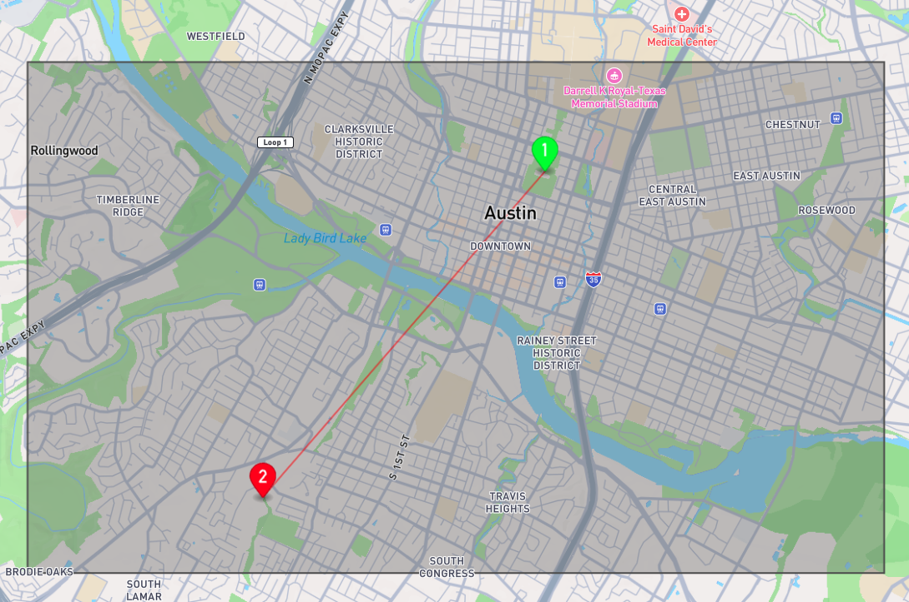

## Seattle
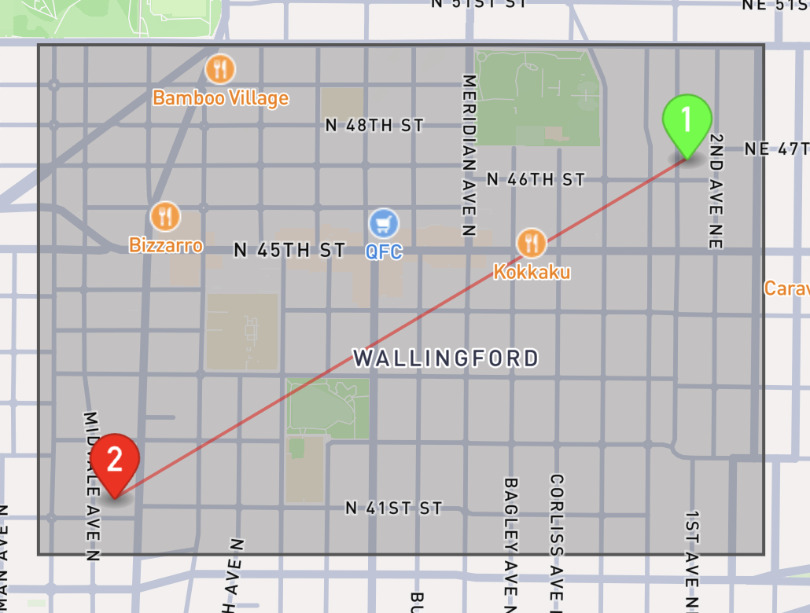

## Portland
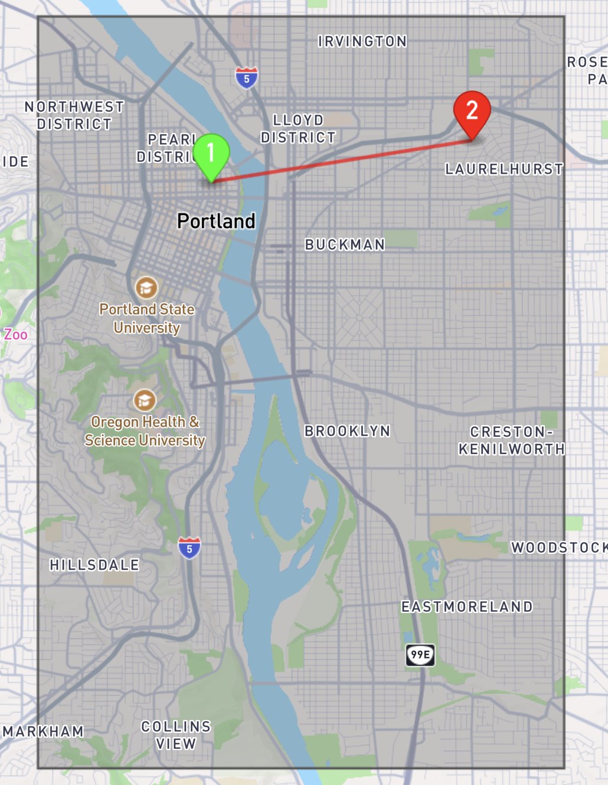

NOTE: The above does not represent the actual stations. The stations will be shown below.

## Downloading the GeoJson Files
Since the geojson files are too large, find the `data` folder and download the geojson files. Then add these files to the `src/sample-test-set` directory.
(Or you could ignore this step if you are just loading from the `.npz` file)

## How to Run
`PYTHONPATH=./src python3 src/sample-test-set/road_test_set.py`

Needs to be run like this because of some weird directory issue I dealt with.

## Results
Once you run the file, it will process each test set one by one and will display raster and the goal state raster

## Austin
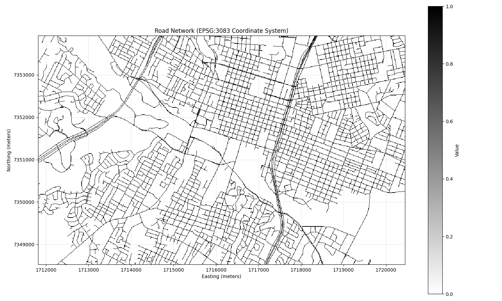
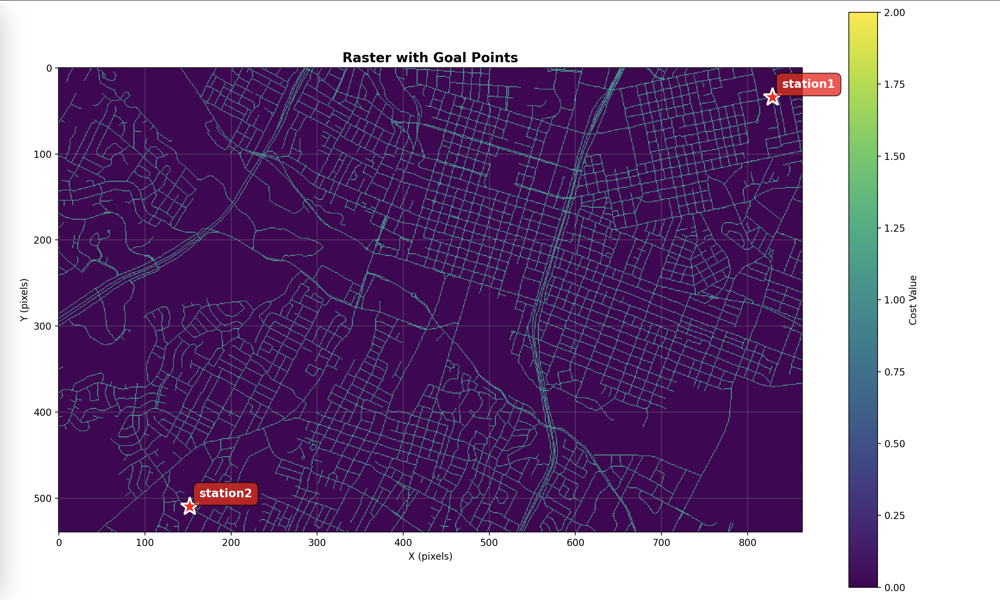

## Seattle
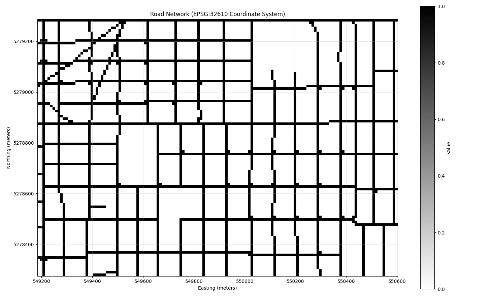
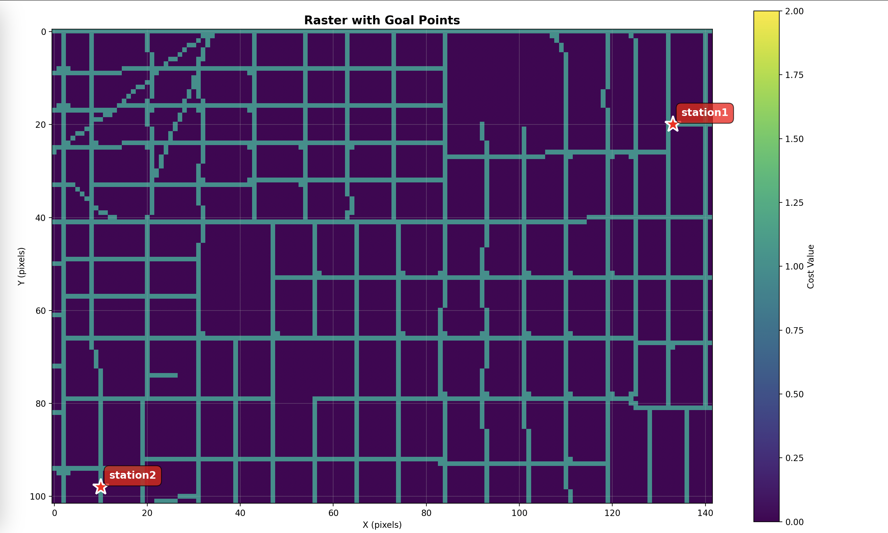

## Portland
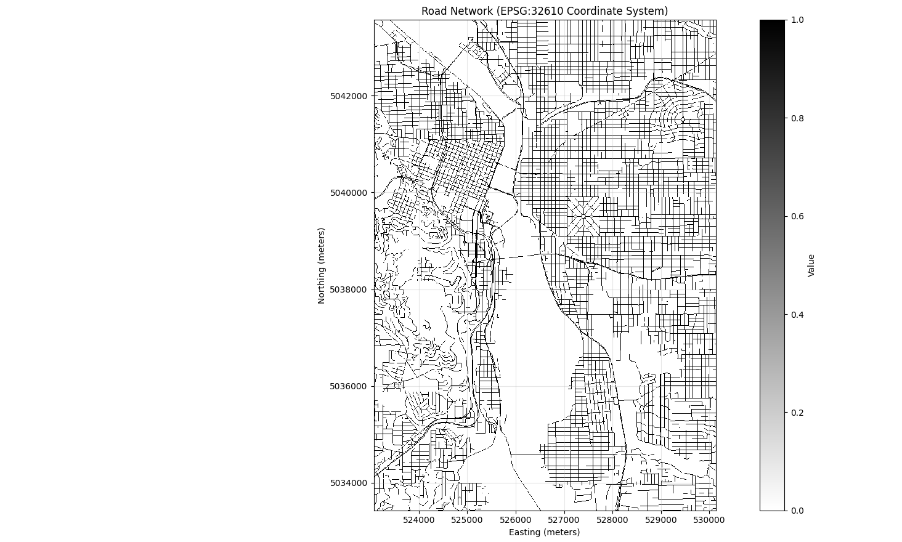
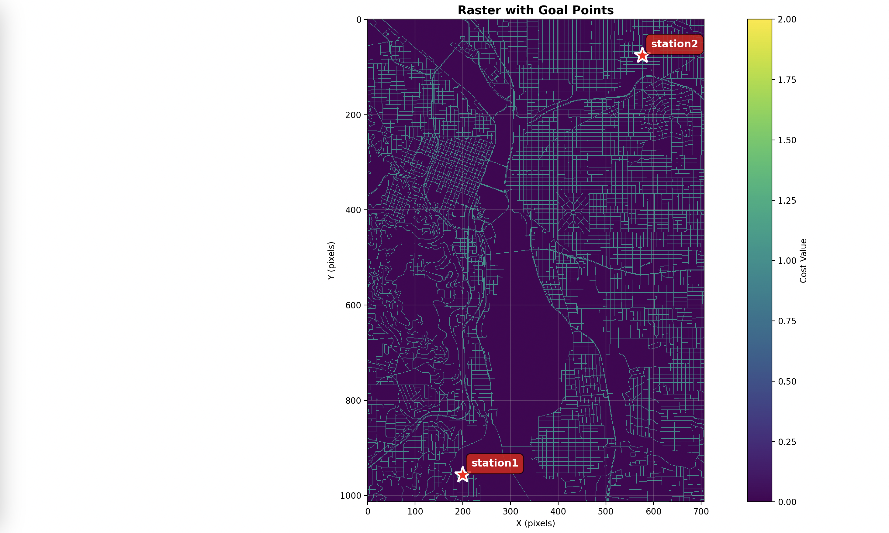

## How to use
You can simply copy and paste the code within each test set and just use that within your code and use the `test_raster[_]` variable to run your experiment A* on.

However, you can also use the .npz file to load the raster and the goal points (aka stations). Look at the `load_npz_raster.py` file.

To see how to load, run the following command:
`PYTHONPATH=./src python3 src/sample-test-set/load_npz_raster.py`

Running on the docker envr, the images will be saved in `/outputs` since you are exec'd into the docker container and will not display the matplot plots.

Run the following command to see the overlay onto the basemap/satellite imagery:
`PYTHONPATH=./src python3 src/sample-test-set/load_npz_raster_basemap.py`

Sample image results of basemap/satellite display.
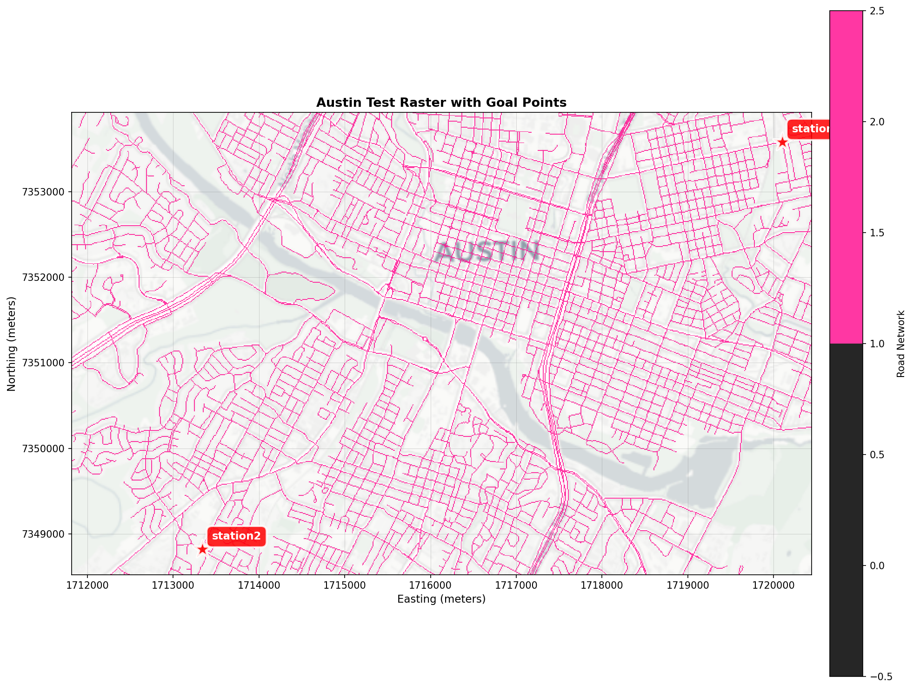
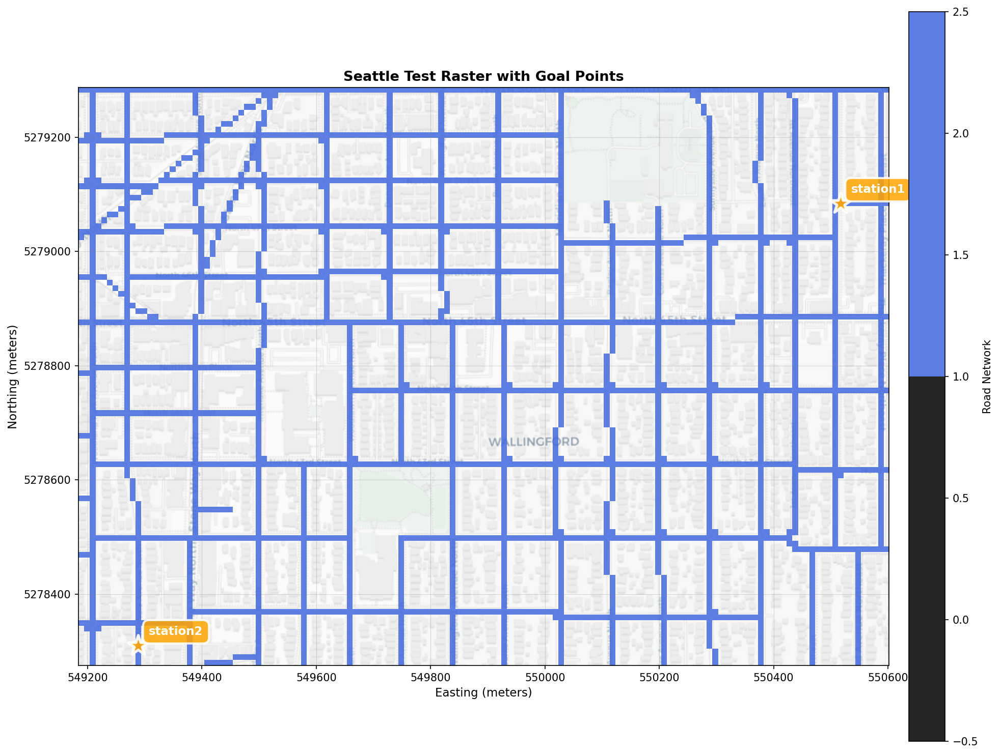
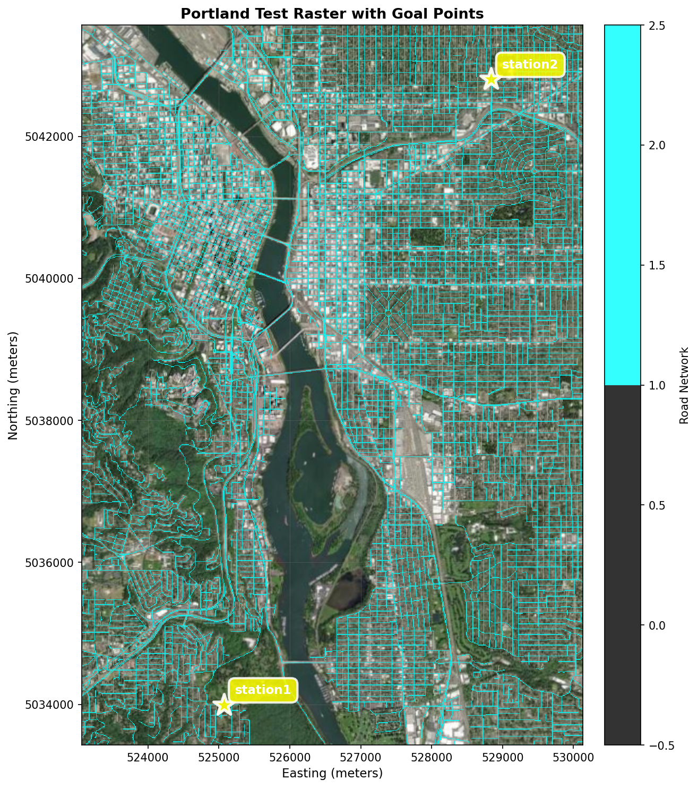

## Note on Using the Docker Container
(Update 11/22/25)
The src folder is now setup to be mounted on the conatiner. So rebuild and you can now just work within the src folder. 